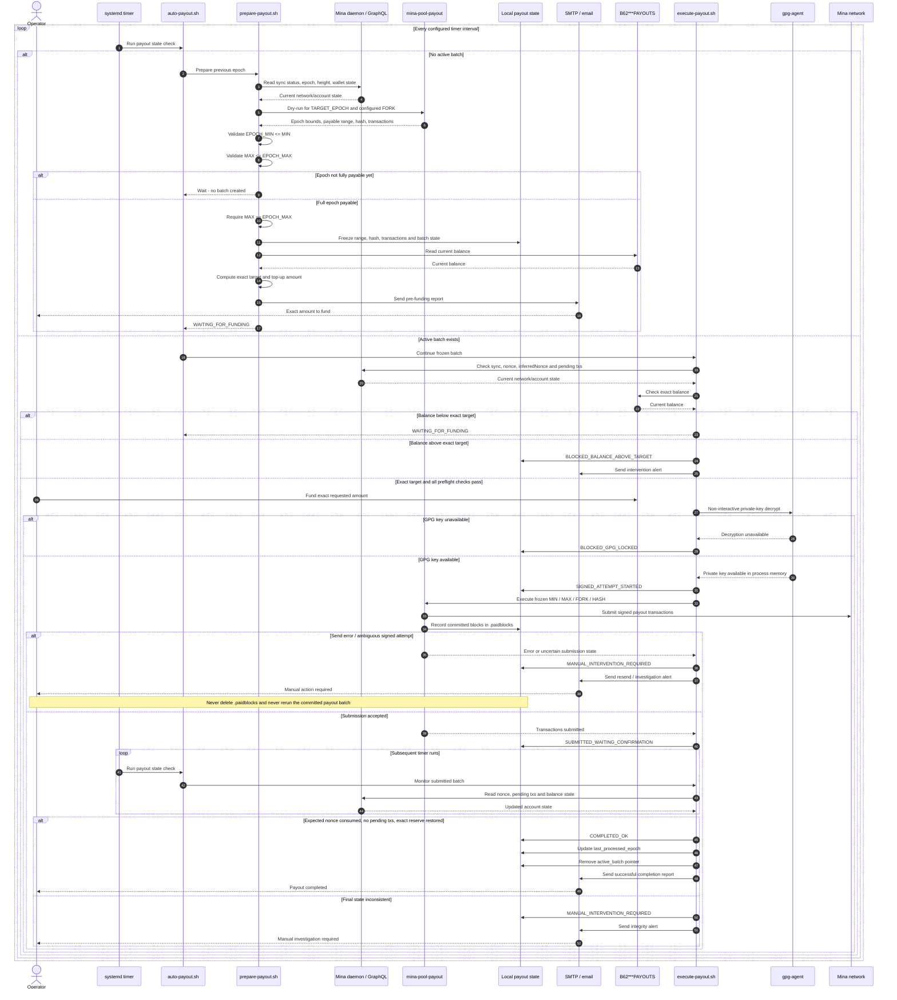

# Mina Automatic Payouts

Secure automation layer for Mina block producer payouts using the original
[`mina-pool-payout`](https://github.com/jrwashburn/mina-pool-payout) calculation engine.

**Start here:** [Quick setup guide](QUICKSTART.md) — 7 steps, copyable commands,
example emails and an end-to-end wallet funding example.

Supported environments:

- **Native Linux + systemd**
- **WSL2 + Ubuntu + systemd**

The automation is designed to:

- detect the previous completed epoch;
- wait until the entire epoch is payable after the configured confirmation delay;
- perform one dry-run;
- freeze the exact block range and payout hash;
- calculate the exact amount required to fund a dedicated payout wallet;
- send a pre-funding report by email;
- wait for manual wallet funding;
- automatically execute the frozen payout once every safety condition is met;
- monitor transaction submission and account nonces;
- verify the final wallet balance;
- prevent automatic double payouts;
- stop and require manual intervention whenever the payout state becomes ambiguous.

---

# High-level sequence diagram

The following sequence shows the normal automatic payout lifecycle and the
main safety boundaries.



The key irreversible boundary is:

```text
SIGNED_ATTEMPT_STARTED
```

Once a batch reaches that state, or may have crossed it, the automation never
automatically executes that payout batch again. Any transmission recovery is
performed from the existing transaction artifacts using the manual `resend`
workflow.

---

# 1. Security model

The most important file in `mina-pool-payout` is:

```text
src/data/.paidblocks
```

It is the primary protection against duplicate payouts.

Its meaning is:

```text
these blocks have already been committed to a payout
```

It does **not** necessarily mean:

```text
every transaction from that payout has already been confirmed
```

## Absolute rule

Never automate this sequence:

```text
send error
   ↓
delete or modify .paidblocks
   ↓
recalculate the payout
   ↓
send the payout again
```

If a transmission fails, recovery must use the `.gql` files generated by
`mina-pool-payout` and its `resend` workflow:

```bash
npm run resend -- -f=<FIRST_NONCE> -t=<LAST_NONCE>
```

A payout batch that has been signed, or may have been signed, is **never
automatically executed again**.

---

# 2. Generic placeholders used in this document

Replace the following placeholders with values specific to your installation.

```text
<USER>                   Linux account running the payout automation

B62***BP                 Mina block producer public key
B62***PAYOUTS            Dedicated automatic payout wallet public key

operator@example.com     Email address receiving payout reports
sender@example.com       Sender address used by msmtp

encrypted_key.gpg    GPG-encrypted Mina private key file

<POOL_MEMO_PREFIX>       Prefix used for payout transaction memos

<FORK>                   Current mina-pool-payout fork / era identifier
<POOL_COMMISSION>        Block producer commission rate
<O1_COMMISSION>          O1 commission rate
<RESERVE_MINA>           Permanent balance kept on the payout wallet
```

Examples in this README use:

```text
B62***BP
B62***PAYOUTS
```

instead of real Mina addresses.

---

# 3. Directory layout

Recommended installation directory:

```text
$HOME/mina-scripts/payouts/mina-pool-payout
```

Main files:

```text
mina-pool-payout/
├── auto-payout.conf
├── auto-payout.sh
├── prepare-payout.sh
├── execute-payout.sh
├── encrypted_key.gpg
├── .env
├── src/
│   └── data/
│       ├── .paidblocks
│       ├── <nonce>.gql
│       ├── <nonce>.json
│       ├── payout_transactions_*.json
│       ├── payout_details_*.json
│       └── payout_summary_*.json
└── .auto-payout/
    ├── active_batch
    ├── last_processed_epoch
    ├── batches/
    ├── locks/
    └── notified/
```

The orchestration flow is:

```text
systemd timer
      ↓
auto-payout.sh
      │
      ├── no active batch
      │      └── prepare-payout.sh
      │
      └── active batch
             └── execute-payout.sh
```

`auto-payout.sh` is the only entry point that should normally be called by
systemd.

---

# 4. Example payout parameters

A generic installation may use:

```text
Block producer             : B62***BP
Automatic payout wallet    : B62***PAYOUTS
Fork / era                  : <FORK>
Pool commission             : <POOL_COMMISSION>
O1 commission               : <O1_COMMISSION>
Permanent wallet reserve    : <RESERVE_MINA> MINA
MIN_CONFIRMATIONS           : 50
Mina GraphQL endpoint       : http://127.0.0.1:3085/graphql
```

Example memo pattern:

```text
<POOL_MEMO_PREFIX><EPOCH>_payout
```

The fork is configurable. The scripts are not intrinsically limited to fork
`2`; the active fork is defined in `auto-payout.conf`.

---

# 5. Common prerequisites

Install the required tools:

```bash
sudo apt update

sudo apt install \
  curl \
  jq \
  python3 \
  util-linux \
  gnupg \
  msmtp \
  msmtp-mta \
  ca-certificates \
  git
```

`flock` is provided by `util-linux`.

Verify:

```bash
command -v curl
command -v jq
command -v python3
command -v flock
command -v gpg
command -v sendmail
command -v git
command -v npm
```

You also need:

- a working Mina daemon;
- a GraphQL endpoint accessible to the automation;
- Node.js and npm;
- a dedicated Mina payout account;
- the payout wallet private key encrypted with GPG;
- an SMTP account for report delivery.

---

# 6. WSL2: enable systemd

This section applies only to WSL2.

Check PID 1:

```bash
ps -p 1 -o comm=
```

Expected:

```text
systemd
```

If systemd is not enabled, edit:

```bash
sudo vim /etc/wsl.conf
```

Add:

```ini
[boot]
systemd=true
```

Then, from Windows:

```powershell
wsl --shutdown
```

Start the distribution again and verify:

```bash
ps -p 1 -o comm=
```

Expected:

```text
systemd
```

## WSL2 limitation

Even with `linger=yes`, user services cannot run while the whole WSL
distribution is stopped.

For example:

```powershell
wsl --shutdown
```

stops:

```text
systemd
systemd --user
mina-auto-payout.timer
mina-auto-payout.service
the local Mina daemon
```

---

# 7. Native Linux: verify systemd

On a modern native Linux installation:

```bash
ps -p 1 -o comm=
```

Expected:

```text
systemd
```

No WSL-specific configuration is required.

As long as the Linux machine is running, systemd can keep the timer active.

---

# 8. Install `mina-pool-payout`

```bash
mkdir -p "$HOME/mina-scripts/payouts"
cd "$HOME/mina-scripts/payouts"

git clone https://github.com/jrwashburn/mina-pool-payout.git
cd mina-pool-payout
```

Install dependencies:

```bash
npm install
```

Verify the project:

```bash
npm run payout -- --help
```

The reference installation uses `mina-pool-payout` **1.7.4**, commit
`12ebcce`. Compatibility with other revisions has not been verified here.
The wrapper reads the engine's output and transaction artifacts, so validate
compatibility before upgrading the engine.

The payout calculation engine is **not reimplemented** by the wrapper scripts.
All payout calculations remain the responsibility of `mina-pool-payout`.

---

# 9. Node.js / npm

There are two common installations.

## Node installed with NVM

Check:

```bash
command -v node
command -v npm
```

Example:

```text
/home/<USER>/.nvm/versions/node/vXX.XX.X/bin/node
/home/<USER>/.nvm/versions/node/vXX.XX.X/bin/npm
```

The systemd user service must explicitly load NVM.

## Node installed globally

Example:

```text
/usr/bin/node
/usr/bin/npm
```

In that case the systemd service can invoke `auto-payout.sh` directly.

---

# 10. Configure `.env`

The original `.env` file remains part of the `mina-pool-payout`
configuration.

Example:

```dotenv
BLOCK_DATA_SOURCE=API

COMMISSION_RATE=<POOL_COMMISSION>
MF_COMMISSION_RATE=0.08
O1_COMMISSION_RATE=<O1_COMMISSION>
INVESTORS_COMMISSION_RATE=0.08

POOL_PUBLIC_KEY=B62***BP
POOL_MEMO="<POOL_MEMO_PREFIX>0_payout"

SEND_TRANSACTION_FEE=0.001
SEND_PAYOUT_THRESHOLD=0.002

SEND_PRIVATE_KEY=
SEND_PUBLIC_KEY=B62***PAYOUTS

NUM_SLOTS_IN_EPOCH=7140
MIN_CONFIRMATIONS=50

SEND_PAYMENT_GRAPHQL_ENDPOINT=http://127.0.0.1:3085/graphql
MINAEXPLORER_GRAPHQL_ENDPOINT=https://graphql.minaexplorer.com
PAYOUT_DATA_PROVIDER_API_ENDPOINT=https://api.minastakes.com

DO_NOT_SAVE_TRANSACTION_DETAILS=FALSE

PAYOUT_CALCULATOR=postSuperChargeCommonShareFees
```

Adapt transaction fees, payout thresholds and calculator settings to your
existing pool configuration.

## Manual and automatic payout wallets may differ

It is possible to preserve an existing manual payout workflow using one wallet
while the automatic workflow uses another.

For example:

```text
.env
SEND_PUBLIC_KEY=<MANUAL_PAYOUT_WALLET>
```

while:

```text
auto-payout.conf
PAYOUT_PUBLIC_KEY=B62***PAYOUTS
```

The automatic scripts explicitly export:

```bash
export SEND_PUBLIC_KEY="$PAYOUT_PUBLIC_KEY"
```

before invoking `mina-pool-payout`.

You can verify that exported variables override `.env`:

```bash
export SEND_PUBLIC_KEY="TEST_AUTOMATIC_OVERRIDE"

npm exec -- tsx --env-file=.env -e \
  'console.log(process.env.SEND_PUBLIC_KEY)'

unset SEND_PUBLIC_KEY
```

Expected:

```text
TEST_AUTOMATIC_OVERRIDE
```

This allows:

```text
manual wrapper
    ↓
.env wallet

automatic workflow
    ↓
auto-payout.conf wallet
```

to coexist safely.

---

# 11. Encrypt the automatic payout private key with GPG

The current executor requires the filename `encrypted_key.gpg` in the engine
repository root. This filename is fixed, not configurable.

Never store the automatic payout private key in plaintext.

From the repository:

```bash
cd "$HOME/mina-scripts/payouts/mina-pool-payout"
```

Read the key without adding it to shell history:

```bash
read -s -p "Mina private key: " PRIVATE_KEY
echo
```

Encrypt it:

```bash
printf '%s' "$PRIVATE_KEY" \
  | gpg --symmetric \
        --cipher-algo AES256 \
        --output encrypted_key.gpg
```

Clear the shell variable:

```bash
unset PRIVATE_KEY
```

Protect the file:

```bash
chmod 600 encrypted_key.gpg
```

Test:

```bash
gpg --decrypt encrypted_key.gpg >/dev/null
```

---

# 12. Configure `gpg-agent`

Create or edit:

```bash
mkdir -p "$HOME/.gnupg"
chmod 700 "$HOME/.gnupg"

vim "$HOME/.gnupg/gpg-agent.conf"
```

Example:

```text
default-cache-ttl 86400
max-cache-ttl 2592000
```

On a minimal/headless Linux server, install a terminal pinentry:

```bash
sudo apt install pinentry-curses
```

Then add:

```text
pinentry-program /usr/bin/pinentry-curses
```

to `gpg-agent.conf`.

Restart the agent:

```bash
gpgconf --kill gpg-agent
gpgconf --launch gpg-agent
```

For SSH sessions:

```bash
export GPG_TTY=$(tty)
gpg-connect-agent updatestartuptty /bye
```

You may add this to `~/.bashrc`:

```bash
export GPG_TTY=$(tty)
```

Unlock the key once:

```bash
gpg --decrypt encrypted_key.gpg >/dev/null
```

Then test non-interactive decryption:

```bash
gpg --batch \
  --pinentry-mode error \
  --decrypt encrypted_key.gpg >/dev/null

echo $?
```

Expected:

```text
0
```

The automation intentionally uses:

```text
--pinentry-mode error
```

so it can never wait indefinitely for an interactive password prompt.

If the GPG cache expires, the payout remains blocked until the key is manually
unlocked again.

---

# 13. Configure Gmail / SMTP with `msmtp`

Create:

```bash
vim "$HOME/.msmtprc"
```

Example:

```ini
defaults
auth           on
tls            on
tls_starttls   on
tls_trust_file /etc/ssl/certs/ca-certificates.crt
logfile        ~/.msmtp.log

account        gmail
host           smtp.gmail.com
port           587
timeout        30

from           sender@example.com
user           sender@example.com
password       GOOGLE_APP_PASSWORD

account default : gmail
```

Protect the file:

```bash
chmod 600 "$HOME/.msmtprc"
```

Use a Google **App Password**, not the account's normal password.

Do not publish `msmtp -v` output: SMTP `AUTH PLAIN` data is Base64-encoded and
can expose the credentials.

Test:

```bash
printf "Subject: Mina payout test\n\nSMTP test.\n" \
  | timeout 20s sendmail operator@example.com

echo "RC=$?"
```

Expected:

```text
RC=0
```

Check:

```bash
tail -5 "$HOME/.msmtp.log"
```

A successful SMTP delivery normally shows a `250` status.

## If SMTP hangs on IPv6

If:

```bash
timeout 10s bash -c 'echo > /dev/tcp/smtp.gmail.com/587'
```

times out, but:

```bash
curl -4 -v telnet://smtp.gmail.com:587 --connect-timeout 10
```

connects immediately, the server likely has incomplete IPv6 connectivity.

Find the IPv4 source address:

```bash
ip -4 route get 8.8.8.8 | grep -oP 'src \K\S+'
```

Then add to the Gmail account in `.msmtprc`:

```ini
source_ip YOUR_SERVER_IPV4
timeout 30
```

This forces msmtp to use that IPv4 source address without disabling IPv6
globally.

---

# 14. Create `auto-payout.conf`

Download this wrapper into a separate directory:

```bash
git clone https://github.com/naamahdaemon/mina-auto-payouts.git "$HOME/mina-auto-payouts"
```

For a new installation, copy the configuration template without overwriting
an existing configuration:

```bash
cp -n "$HOME/mina-auto-payouts/auto-payout.conf.example" \
  "$HOME/mina-scripts/payouts/mina-pool-payout/auto-payout.conf"
chmod 600 "$HOME/mina-scripts/payouts/mina-pool-payout/auto-payout.conf"
```

Replace every placeholder with your own settings before running the wrapper.
Edit:

```bash
cd "$HOME/mina-scripts/payouts/mina-pool-payout"
vim auto-payout.conf
```

Example:

```bash
# Mina block producer
BP_PUBLIC_KEY="B62***BP"

# Dedicated automatic payout wallet
PAYOUT_PUBLIC_KEY="B62***PAYOUTS"

# Current mina-pool-payout fork / era
FORK="<FORK>"

# Commission settings
POOL_COMMISSION="<POOL_COMMISSION>"
O1_COMMISSION="<O1_COMMISSION>"

# Memo prefix
POOL_MEMO_PREFIX="<POOL_MEMO_PREFIX>"

# Permanent balance kept after every completed batch
PAYOUT_RESERVE_MINA="<RESERVE_MINA>"

# Local Mina GraphQL endpoint
GRAPHQL_ENDPOINT="http://127.0.0.1:3085/graphql"

# Email reports
MAIL_TO="operator@example.com"
MAIL_FROM="sender@example.com"
MAIL_SUBJECT_PREFIX="[Mina payout]"

# Optional explicit sendmail-compatible binary
SENDMAIL_BIN="/usr/sbin/sendmail"
```

Protect it:

```bash
chmod 600 auto-payout.conf
```

---

# 15. Install the automation scripts

Copy the scripts into the **engine repository root**. They locate the engine,
configuration and payout state relative to their own directory:

```bash
cd "$HOME/mina-auto-payouts"
cp auto-payout.sh prepare-payout.sh execute-payout.sh \
  "$HOME/mina-scripts/payouts/mina-pool-payout/"
cd "$HOME/mina-scripts/payouts/mina-pool-payout"
```

For an existing installation, follow section 39 before replacing scripts.

Installed scripts:

```text
prepare-payout.sh
execute-payout.sh
auto-payout.sh
```

Documentation baseline:

```text
prepare-payout.sh : v9
execute-payout.sh : v3
auto-payout.sh    : current orchestrator
```

Permissions:

```bash
chmod 700 prepare-payout.sh
chmod 700 execute-payout.sh
chmod 700 auto-payout.sh
```

Validate syntax:

```bash
bash -n prepare-payout.sh
bash -n execute-payout.sh
bash -n auto-payout.sh
```

No output means Bash syntax validation succeeded.

---

# 16. `.auto-payout` state directory

The scripts create:

```text
.auto-payout/
├── active_batch
├── last_processed_epoch
├── batches/
├── locks/
└── notified/
```

## `last_processed_epoch`

Contains the last epoch that has been completely processed by the automation.

Example:

```bash
cat .auto-payout/last_processed_epoch
```

```text
0
```

An epoch with zero remaining payout transactions is also considered processed.

This prevents the timer from recalculating the same already-paid epoch every
few minutes.

## `active_batch`

Exists only while a payout batch is in progress.

Check it with:

```bash
test -e .auto-payout/active_batch \
  && cat .auto-payout/active_batch \
  || echo "No active batch"
```

---

# 17. Automatic epoch selection

In automatic mode:

```text
TARGET_EPOCH = CURRENT_EPOCH - 1
```

Example:

```text
CURRENT_EPOCH = 2
TARGET_EPOCH  = 1
```

The automation never intentionally creates a regular automatic batch from the
current, still-running epoch.

---

# 18. Epoch boundary protection

`prepare-payout.sh` retrieves both:

```text
Epoch Minimum Height
Epoch Maximum Height
```

from `mina-pool-payout`, together with the currently payable range:

```text
MIN -> MAX
```

The v9 safety rules are:

```text
MIN >= EPOCH_MIN
MAX <= EPOCH_MAX
```

in **all modes**.

Therefore a payout range is rejected if it contains a block before or after
the requested epoch.

In automatic mode there is one additional rule:

```text
MAX == EPOCH_MAX
```

before a batch may be created.

So the automatic rules are:

```text
EPOCH_MIN <= MIN
MAX <= EPOCH_MAX
MAX == EPOCH_MAX
```

This guarantees:

```text
no block before the epoch
no block after the epoch
the end of the epoch must be fully payable
```

before an automatic batch is frozen.

---

# 19. Manual partial-epoch testing

You may intentionally test an incomplete epoch by providing the epoch number:

```bash
./prepare-payout.sh <EPOCH>
```

For example:

```bash
./prepare-payout.sh 1
```

This sets manual mode.

The boundary checks still apply:

```text
MIN >= EPOCH_MIN
MAX <= EPOCH_MAX
```

but:

```text
MAX < EPOCH_MAX
```

is allowed for testing.

Therefore:

```text
manual explicit epoch
    ↓
partial epoch allowed
    ↓
blocks outside that epoch still forbidden
```

Do **not** fund or execute such a test batch unless it is intentionally meant
to become a real payout.

---

# 20. Preparing a payout batch

In normal automatic operation, `prepare-payout.sh` performs one dry-run:

```bash
npm run payout -- -e=<EPOCH> -f=<FORK>
```

It extracts and records:

- epoch minimum height;
- epoch maximum height;
- payable minimum height;
- payable maximum height;
- payout hash;
- transaction list;
- payout details;
- exact batch cost.

The batch is frozen under:

```text
.auto-payout/batches/
└── epoch<EPOCH>_<MIN>_<MAX>_<HASH>/
    ├── state.json
    ├── report.txt
    ├── simulation.log
    ├── simulation.raw.log
    ├── payout_transactions.json
    └── payout_details.json
```

The real execution later reuses the exact frozen range and hash:

```bash
npm run payout -- \
  -m=<MIN> \
  -x=<MAX> \
  -f=<FORK> \
  -h=<HASH>
```

This prevents newly eligible blocks from silently entering an already-funded
batch.

---

# 21. Exact funding model

The automatic payout wallet keeps a permanent reserve:

```text
<RESERVE_MINA> MINA
```

The exact batch cost is derived from the final payout transaction set.

The accounting invariant is:

```text
TARGET BEFORE PAYOUT = permanent reserve + exact batch cost
TOP-UP REQUIRED       = target - current wallet balance
EXPECTED AFTER PAYOUT = permanent reserve
```

The safety-critical calculations are performed in integer nanoMINA.

Example:

```text
Batch cost        : 1000.123456789 MINA
Permanent reserve :   20.000000000 MINA
-----------------------------------------
Target            : 1020.123456789 MINA
```

Funding is intentionally strict:

```text
balance < target
    => WAITING_FOR_FUNDING

balance == target
    => ready for execution

balance > target
    => BLOCKED_BALANCE_ABOVE_TARGET
```

The wallet should therefore be funded with the exact requested amount.

---

# 22. Pre-funding email

When a valid batch is created, the report contains:

```text
status
epoch
fork
frozen block range
full epoch range
daemon height
payout hash
payout wallet
transaction count
payout amounts
transaction fees
batch cost
permanent reserve
current wallet balance
target before payout
exact amount to fund
expected balance after payout
wallet nonce
inferred nonce
pending transaction count
full mina-pool-payout dry-run output
```

Messages are sent as:

```text
multipart/alternative
```

with:

```text
text/plain
+
text/html
```

The HTML version uses a `<pre>` block with a monospace font so the
`mina-pool-payout` ASCII tables remain aligned in mail clients.

Notification markers under:

```text
.auto-payout/notified/
```

prevent the same report from being sent repeatedly on every timer run.

---

# 23. Preflight checks before private-key decryption

Before touching the private key, `execute-payout.sh` checks:

1. the local Mina daemon reports `SYNCED`;
2. the block producer matches the stored batch;
3. the payout wallet matches the stored batch;
4. the configured fork matches the stored batch;
5. the frozen block range is valid;
6. the payout hash has the expected format;
7. there are no pending transactions from the payout account;
8. `nonce == inferredNonce`;
9. the wallet balance exactly matches the required target;
10. there are no conflicting `<nonce>.gql` or `<nonce>.json` files for the
    nonce range that would be used.

Only after these checks is the automatic payout private key decrypted.

---

# 24. Irreversible signed-attempt boundary

Immediately before calling the real payout command, the batch status becomes:

```text
SIGNED_ATTEMPT_STARTED
```

This happens **before**:

```bash
npm run payout ...
```

From that moment onward, the automation must never run that payout batch
again.

If the process, daemon, WSL instance or machine crashes after this point, the
next automation run converts the ambiguous state to:

```text
SIGNED_ATTEMPT_UNKNOWN
```

and automatic execution is blocked.

The operator must investigate manually.

---

# 25. `.paidblocks` behavior

The original `mina-pool-payout` behavior is deliberately preserved.

When a payout is committed, its blocks are recorded in:

```text
src/data/.paidblocks
```

This protects against recalculating and sending the same block rewards again.

Consider:

```text
transaction A sent
transaction B sent
transaction C fails
```

The batch must **not** be recalculated.

The blocks remain protected by `.paidblocks`, while failed or unsent
transactions are recovered using `resend`.

---

# 26. Transmission errors and manual resend

The underlying payout engine may report:

```text
*** ERROR SENDING TRANSACTIONS - STOPPED SENDING AT NONCE 12345 ***
```

The automation changes the batch state to:

```text
MANUAL_INTERVENTION_REQUIRED
```

and sends an alert containing:

```text
failed nonce
last payout nonce
manual resend command
```

Example:

```bash
npm run resend -- -f=12345 -t=12413
```

Do **not**:

```text
rerun prepare-payout.sh for the same committed batch
rerun the full signed payout
delete .paidblocks
```

Only resend the missing signed transactions.

---

# 27. Post-submission confirmation

After an apparently successful submission, the batch becomes:

```text
SUBMITTED_WAITING_CONFIRMATION
```

From that state onward, the automation no longer runs the payout command.

It only monitors:

```text
account.nonce
inferredNonce
pooledUserCommands
wallet balance
```

Example:

```text
start nonce       = 4000
transaction count = 69
```

The batch uses:

```text
4000 -> 4068
```

and expects the account nonce to eventually reach:

```text
4069
```

The batch completes only when:

```text
nonce >= expected_next_nonce
pending transactions == 0
wallet balance == permanent reserve
```

---

# 28. Final wallet integrity check

The payout wallet is expected to return exactly to:

```text
<RESERVE_MINA> MINA
```

If it does, the batch becomes:

```text
COMPLETED_OK
```

The automation then:

- sends a success email;
- writes the epoch to `.auto-payout/last_processed_epoch`;
- removes `.auto-payout/active_batch`;
- allows the next epoch to be processed.

If the expected nonces are consumed but the wallet balance is different, the
batch becomes:

```text
MANUAL_INTERVENTION_REQUIRED
```

with:

```text
FINAL_BALANCE_MISMATCH
```

No new batch is started automatically.

---

# 29. Main batch states

Typical states include:

```text
WAITING_FOR_FUNDING
FUNDED_READY_FOR_EXECUTION
BLOCKED_PENDING_TRANSACTION
BLOCKED_BALANCE_ABOVE_TARGET
BLOCKED_GPG_LOCKED
SIGNED_ATTEMPT_STARTED
SIGNED_ATTEMPT_UNKNOWN
SUBMITTED_WAITING_CONFIRMATION
MANUAL_INTERVENTION_REQUIRED
HASH_MISMATCH
COMPLETED_OK
TEST_DISCARDED
```

Simplified flow:

```text
completed epoch
      ↓
dry-run
      ↓
WAITING_FOR_FUNDING
      ↓
exact funding
      ↓
GPG available
      ↓
SIGNED_ATTEMPT_STARTED
      ↓
signed payout
      │
      ├── transmission problem
      │       ↓
      │   MANUAL_INTERVENTION_REQUIRED
      │       ↓
      │   manual resend
      │
      └── submission accepted
              ↓
SUBMITTED_WAITING_CONFIRMATION
              ↓
nonce / mempool / balance checks
              │
              ├── anomaly
              │      ↓
              │   MANUAL_INTERVENTION_REQUIRED
              │
              └── all checks pass
                     ↓
                 COMPLETED_OK
```

---

# 30. Install the systemd user service

Create:

```bash
mkdir -p "$HOME/.config/systemd/user"
```

The supplied `mina-auto-payout.service` is the globally installed Node/npm
variant. To install it:

```bash
cp "$HOME/mina-auto-payouts/mina-auto-payout.service" \
  "$HOME/.config/systemd/user/"
```

It assumes the engine is installed at
`$HOME/mina-scripts/payouts/mina-pool-payout`. Adapt paths for another location.
For NVM, replace its contents with the following variant before starting it.

## NVM version

If `npm` lives under `$HOME/.nvm`, create:

```bash
vim "$HOME/.config/systemd/user/mina-auto-payout.service"
```

with:

```ini
[Unit]
Description=Mina automatic payout orchestrator

[Service]
Type=oneshot
WorkingDirectory=%h/mina-scripts/payouts/mina-pool-payout
Environment=GNUPGHOME=%h/.gnupg
ExecStart=/bin/bash -lc 'source "$HOME/.nvm/nvm.sh" && nvm use default >/dev/null && exec "$HOME/mina-scripts/payouts/mina-pool-payout/auto-payout.sh"'
StandardOutput=journal
StandardError=journal
```

## Globally installed Node/npm

If `npm` is available as something like `/usr/bin/npm`, use:

```ini
[Unit]
Description=Mina automatic payout orchestrator

[Service]
Type=oneshot
WorkingDirectory=%h/mina-scripts/payouts/mina-pool-payout
Environment=GNUPGHOME=%h/.gnupg
ExecStart=%h/mina-scripts/payouts/mina-pool-payout/auto-payout.sh
StandardOutput=journal
StandardError=journal
```

Reload:

```bash
systemctl --user daemon-reload
```

Test:

```bash
systemctl --user start mina-auto-payout.service
```

Check:

```bash
systemctl --user status mina-auto-payout.service --no-pager
```

Logs:

```bash
journalctl --user \
  -u mina-auto-payout.service \
  -n 100 \
  --no-pager
```

A successful oneshot service may become:

```text
inactive (dead)
```

after execution.

What matters is:

```text
status=0/SUCCESS
```

or:

```text
mina-auto-payout.service: Succeeded.
```

---

# 31. Test GPG from the systemd user context

Run:

```bash
systemd-run --user --wait --pipe \
  /bin/bash -lc \
  'gpg --batch --pinentry-mode error --decrypt "$HOME/mina-scripts/payouts/mina-pool-payout/encrypted_key.gpg" >/dev/null'
```

Expected:

```text
Finished with result: success
Main processes terminated with: code=exited/status=0
```

This confirms the user service can access the cached GPG passphrase.

---

# 32. `loginctl` and `linger`

The payout units are user services:

```bash
systemctl --user
```

They belong to the systemd user manager of `<USER>`.

Enable lingering:

```bash
sudo loginctl enable-linger <USER>
```

Check:

```bash
loginctl show-user <USER> -p Linger
```

Expected:

```text
Linger=yes
```

`linger` allows the user's systemd manager to exist even when no interactive
SSH/login session is open.

## Native Linux

Typical boot flow:

```text
machine boot
   ↓
systemd
   ↓
systemd --user for <USER>
   ↓
mina-auto-payout.timer
```

No SSH login is required.

## WSL2

The same user manager can remain active without an SSH shell, but the entire
WSL distribution still has to be running.

Disable lingering if ever required:

```bash
sudo loginctl disable-linger <USER>
```

---

# 33. Install the systemd timer

Install the supplied timer:

```bash
cp "$HOME/mina-auto-payouts/mina-auto-payout.timer" \
  "$HOME/.config/systemd/user/"
```

To customize it:

```bash
vim "$HOME/.config/systemd/user/mina-auto-payout.timer"
```

Example:

```ini
[Unit]
Description=Check Mina automatic payout state every 10 minutes

[Timer]
OnBootSec=2min
OnUnitActiveSec=10min
AccuracySec=30s
Unit=mina-auto-payout.service

[Install]
WantedBy=timers.target
```

Reload:

```bash
systemctl --user daemon-reload
```

Enable and start:

```bash
systemctl --user enable --now mina-auto-payout.timer
```

Check:

```bash
systemctl --user status mina-auto-payout.timer --no-pager
```

Expected:

```text
Active: active (waiting)
```

Show the next run:

```bash
systemctl --user list-timers mina-auto-payout.timer
```

---

# 34. Why the timer runs every 10 minutes

This does **not** mean one payout every 10 minutes.

The timer only runs:

```text
auto-payout.sh
```

every 10 minutes.

The orchestrator then decides whether anything must happen.

Typical idle result:

```text
Epoch N already processed; nothing to do.
```

While waiting for funding:

```text
Waiting for funding: X MINA still required.
```

After submission:

```text
Waiting for confirmation...
```

The timer interval only controls how quickly the automation notices:

- a new completed epoch;
- manual funding;
- transaction confirmation;
- the final wallet balance.

---

# 35. Installation tests

## Test 1 — manual orchestrator run

```bash
./auto-payout.sh
```

If the previous epoch has already been processed:

```text
Epoch N already processed; nothing to do.
```

## Test 2 — last processed epoch

```bash
cat .auto-payout/last_processed_epoch
```

## Test 3 — active batch

```bash
test -e .auto-payout/active_batch \
  && cat .auto-payout/active_batch \
  || echo "No active batch"
```

## Test 4 — systemd service

```bash
systemctl --user start mina-auto-payout.service
```

Then:

```bash
journalctl --user \
  -u mina-auto-payout.service \
  -n 100 \
  --no-pager
```

## Test 5 — GPG through systemd

```bash
systemd-run --user --wait --pipe \
  /bin/bash -lc \
  'gpg --batch --pinentry-mode error --decrypt "$HOME/mina-scripts/payouts/mina-pool-payout/encrypted_key.gpg" >/dev/null'
```

Expected:

```text
status=0
```

## Test 6 — timer

```bash
systemctl --user list-timers mina-auto-payout.timer
```

A future run should be listed.

---

# 36. Safely discard a partial or test batch

A manually created partial batch may be discarded if no signed payout attempt
has occurred.

For example, after:

```bash
./prepare-payout.sh 1
```

first inspect the active batch:

```bash
cd "$HOME/mina-scripts/payouts/mina-pool-payout"

test -e .auto-payout/active_batch \
  && cat .auto-payout/active_batch \
  || echo "No active batch"
```

Load its ID:

```bash
ID=$(cat .auto-payout/active_batch)
echo "$ID"
```

Inspect the state:

```bash
jq . ".auto-payout/batches/$ID/state.json"
```

Verify no signed execution has occurred:

```bash
jq '.execution // "no execution"' \
  ".auto-payout/batches/$ID/state.json"
```

Expected for a pure dry-run/test batch:

```text
"no execution"
```

Also check for an execution log:

```bash
ls -l ".auto-payout/batches/$ID/execution.log"
```

For a batch that was never signed, this file normally does not exist.

## Mark the batch as discarded

```bash
TMP=".auto-payout/batches/$ID/state.json.tmp"

jq '.status="TEST_DISCARDED"
    | .discarded_at_utc=(now|todateiso8601)
    | .discard_reason="Manual partial epoch test"' \
  ".auto-payout/batches/$ID/state.json" > "$TMP"

mv "$TMP" ".auto-payout/batches/$ID/state.json"
```

Remove only the active-batch pointer:

```bash
rm .auto-payout/active_batch
```

Verify:

```bash
test -e .auto-payout/active_batch \
  && cat .auto-payout/active_batch \
  || echo "No active batch"
```

Expected:

```text
No active batch
```

Then:

```bash
jq '.status, .discard_reason' \
  ".auto-payout/batches/$ID/state.json"
```

Expected:

```text
"TEST_DISCARDED"
"Manual partial epoch test"
```

## Do not modify these files

Do **not** modify:

```text
src/data/.paidblocks
```

Do **not** modify:

```text
.auto-payout/last_processed_epoch
```

when discarding a partial test batch.

The archived directory:

```text
.auto-payout/batches/<ID>/
```

may remain on disk as an audit/history record.

## Timer during manual tests

It is recommended to stop the timer before manually preparing a partial batch:

```bash
systemctl --user stop mina-auto-payout.timer
```

After the batch has been discarded:

```bash
systemctl --user start mina-auto-payout.timer
```

If the timer accidentally remained active but:

```text
.execution = "no execution"
```

and no `execution.log` exists, no signed payout attempt occurred.

---

# 37. Daily operational commands

Timer status:

```bash
systemctl --user status mina-auto-payout.timer --no-pager
```

Next run:

```bash
systemctl --user list-timers mina-auto-payout.timer
```

Follow logs:

```bash
journalctl --user \
  -u mina-auto-payout.service \
  -f
```

Recent logs:

```bash
journalctl --user \
  -u mina-auto-payout.service \
  -n 100 \
  --no-pager
```

Last processed epoch:

```bash
cat .auto-payout/last_processed_epoch
```

Active batch:

```bash
test -e .auto-payout/active_batch \
  && cat .auto-payout/active_batch \
  || echo "No active batch"
```

Active batch state:

```bash
ID=$(cat .auto-payout/active_batch)
jq . ".auto-payout/batches/$ID/state.json"
```

---

# 38. Temporarily stop the automation

Stop only the timer:

```bash
systemctl --user stop mina-auto-payout.timer
```

Start it again:

```bash
systemctl --user start mina-auto-payout.timer
```

Disable completely:

```bash
systemctl --user disable --now mina-auto-payout.timer
```

Re-enable:

```bash
systemctl --user enable --now mina-auto-payout.timer
```

---

# 39. Maintenance and upgrades

Before updating `mina-pool-payout` or the wrapper scripts:

```bash
systemctl --user stop mina-auto-payout.timer
```

Check for an active batch:

```bash
test -e .auto-payout/active_batch \
  && cat .auto-payout/active_batch \
  || echo "No active batch"
```

If one exists:

```bash
ID=$(cat .auto-payout/active_batch)
jq . ".auto-payout/batches/$ID/state.json"
```

Avoid upgrades while the batch is in:

```text
SIGNED_ATTEMPT_STARTED
SUBMITTED_WAITING_CONFIRMATION
MANUAL_INTERVENTION_REQUIRED
SIGNED_ATTEMPT_UNKNOWN
```

After changes:

```bash
bash -n prepare-payout.sh
bash -n execute-payout.sh
bash -n auto-payout.sh

systemctl --user daemon-reload
systemctl --user start mina-auto-payout.service
```

Check the logs, then restart the timer:

```bash
systemctl --user start mina-auto-payout.timer
```

---

# 40. Backup

Critical data includes:

```text
src/data/.paidblocks
src/data/*.gql
src/data/*.json
.auto-payout/
encrypted_key.gpg
auto-payout.conf
.env
```

The most important anti-double-payment file is:

```text
src/data/.paidblocks
```

Make sure it is backed up.

Example:

```bash
tar czf "mina-payout-backup-$(date +%Y%m%d-%H%M%S).tar.gz" \
  src/data/.paidblocks \
  src/data/*.gql \
  src/data/*.json \
  .auto-payout \
  encrypted_key.gpg \
  auto-payout.conf \
  .env
```

Adjust the command if some wildcard paths do not exist.

Never store the GPG passphrase or Gmail account password in plaintext backups.

---

# 41. Special or historical epochs

The automatic workflow assumes the configured current fork/era and normally
processes:

```text
CURRENT_EPOCH - 1
```

Historical or exceptional epochs may require explicit:

```text
-m <MIN>
-x <MAX>
-f <OTHER_FORK>
```

For such a case:

```bash
systemctl --user stop mina-auto-payout.timer
```

Handle the special payout using the original manual workflow.

Never bypass `.paidblocks`.

Once the manual operation is complete and the automation state has been
reconciled, restart:

```bash
systemctl --user start mina-auto-payout.timer
```

---

# 42. Fork handling

The scripts are not hardcoded to fork `2`.

The active automatic fork is configured in:

```bash
FORK="<FORK>"
```

inside `auto-payout.conf`.

That value is passed to the preparation command:

```bash
npm run payout -- -e=<EPOCH> -f=<FORK>
```

and stored in the batch state.

The real execution reuses the same frozen fork:

```bash
npm run payout -- \
  -m=<MIN> \
  -x=<MAX> \
  -f=<FORK_STATE> \
  -h=<HASH>
```

For an old epoch belonging to another fork, use the manual/special-epoch
workflow rather than changing the live automatic configuration just for one
historical payout.

---

# 43. Behavior after reboot

## Native Linux

With:

```text
systemd
systemctl --user
linger=yes
timer enabled
```

the user timer can come back after a machine reboot without an SSH login.

Verify:

```bash
loginctl show-user <USER> -p Linger
```

Expected:

```text
Linger=yes
```

Then:

```bash
systemctl --user status mina-auto-payout.timer --no-pager
```

Expected:

```text
Active: active (waiting)
```

The GPG agent passphrase cache may have been lost during reboot.

If necessary:

```bash
cd "$HOME/mina-scripts/payouts/mina-pool-payout"
gpg --decrypt encrypted_key.gpg >/dev/null
```

## WSL2

After WSL restarts:

```bash
systemctl --user status mina-auto-payout.timer --no-pager
```

If the GPG cache is empty:

```bash
gpg --decrypt encrypted_key.gpg >/dev/null
```

The timer will resume normal checks on its next run.

---

# 44. Migration between machines

When moving the payout automation from one machine to another, stop the timer
on the source machine first:

```bash
systemctl --user stop mina-auto-payout.timer
```

Important data to preserve includes:

```text
src/data/.paidblocks
src/data/*.gql
src/data/*.json
.auto-payout/
auto-payout.conf
encrypted_key.gpg
.env
```

On the destination machine:

1. install Node/npm;
2. install `mina-pool-payout`;
3. install dependencies;
4. restore the payout data and wrapper configuration;
5. configure msmtp;
6. configure `gpg-agent`;
7. install the systemd user service;
8. enable linger;
9. install the timer;
10. test GPG through `systemd-run`;
11. manually run `auto-payout.sh`;
12. only then enable the timer.

## Never run two copies against the same automatic payout wallet

Do not run two independent automatic executors on different machines using the
same payout account unless they share a proper distributed locking /
coordination mechanism.

The reason is the Mina account nonce.

Two machines may simultaneously read:

```text
nonce = N
```

and both attempt to use the same next nonce.

A local `flock` only protects processes on the same machine.

The safest architecture for independent block producers is:

```text
Block Producer A
      ↓
Automatic payout wallet A

Block Producer B
      ↓
Automatic payout wallet B
```

This gives each automation an independent:

```text
balance
nonce
transaction queue
reserve
funding target
```

---

# 45. Security summary

The automation is built around these rules:

1. payout calculations remain those of `mina-pool-payout`;
2. a single dry-run freezes the batch;
3. the exact block range and payout hash are stored;
4. a payout range can never cross the target epoch boundaries;
5. automatic batches require the complete epoch to be payable;
6. funding must match the exact target balance;
7. a permanent reserve remains on the payout wallet;
8. the private key is decrypted only after all preflight checks;
9. unattended GPG decryption cannot prompt interactively;
10. `flock` prevents concurrent local executions;
11. `.paidblocks` is never deleted or rewritten by the wrappers;
12. a signed or potentially signed batch is never automatically executed again;
13. transmission failures are recovered only with `resend`;
14. anomalies block subsequent automatic epochs;
15. successful completion requires the exact expected final wallet reserve;
16. independent machines should use independent automatic payout wallets.

---

# 46. Complete normal lifecycle

```text
Mina moves to epoch N
        ↓
automation targets epoch N-1
        ↓
wait until the entire epoch is payable
        ↓
validate:
EPOCH_MIN <= MIN
MAX <= EPOCH_MAX
MAX == EPOCH_MAX
        ↓
single dry-run
        ↓
freeze block range + payout hash
        ↓
calculate exact batch cost
        ↓
send pre-funding email
        ↓
WAITING_FOR_FUNDING
        ↓
operator funds exact requested amount
        ↓
wallet balance = reserve + exact batch cost
        ↓
daemon synced
nonce == inferredNonce
no pending wallet transactions
no conflicting nonce artifacts
        ↓
GPG key available
        ↓
SIGNED_ATTEMPT_STARTED
        ↓
signed payout
        ↓
.paidblocks protects against duplicate payouts
        ↓
never execute that batch automatically again
        ↓
monitor nonce / mempool / balance
        │
        ├── error or ambiguity
        │       ↓
        │   MANUAL_INTERVENTION_REQUIRED
        │       ↓
        │   manual resend / investigation
        │
        └── success
                ↓
        wallet returns exactly to reserve
                ↓
        COMPLETED_OK
                ↓
        success email
                ↓
        last_processed_epoch updated
                ↓
        next epoch allowed
```

---

# 47. Healthy idle state

Typical healthy state:

```bash
cat .auto-payout/last_processed_epoch
```

Example:

```text
0
```

```bash
./auto-payout.sh
```

Example:

```text
Epoch 0 already processed; nothing to do.
```

```bash
loginctl show-user <USER> -p Linger
```

```text
Linger=yes
```

```bash
systemctl --user status mina-auto-payout.timer --no-pager
```

```text
Active: active (waiting)
```

```bash
test -e .auto-payout/active_batch \
  && cat .auto-payout/active_batch \
  || echo "No active batch"
```

```text
No active batch
```

In this state, the installation is operational and waiting for the next fully
payable epoch.


---

# License and credits

This wrapper is distributed under the GNU General Public License v3.0;
see [LICENSE](LICENSE).

Payout calculation and transaction submission are provided by
[`mina-pool-payout`](https://github.com/jrwashburn/mina-pool-payout),
maintained by jrwashburn and its contributors. The engine is installed
separately and retains its own license.

---

# Optional node_exporter payout metrics

[`mina-payout-metrics.sh`](mina-payout-metrics.sh) is a standalone, read-only
collector for a cron job on the payout machine. It needs Bash, Python 3,
`curl` and `flock`, with no Python packages. Python is embedded in the shell
script; only this one file needs installing. It never starts a payout,
loads private keys, or changes payout state.

Install the script:

```bash
sudo install -m 755 mina-payout-metrics.sh /var/lib/node_exporter/mina-payout-metrics.sh
```

The existing `/var/lib/node_exporter/textfile_collector` directory must be
writable by the user running the payout automation and readable/traversable by
node_exporter. Keep the private payout state permissions unchanged. Run the
collector as that user, whose `$HOME` contains the engine installation:

```bash
/var/lib/node_exporter/mina-payout-metrics.sh \
  "$HOME/mina-scripts/payouts/mina-pool-payout" \
  /var/lib/node_exporter/textfile_collector/mina_payout.prom \
  http://127.0.0.1:3085/graphql
cat /var/lib/node_exporter/textfile_collector/mina_payout.prom
```

Add to **the payout automation user's crontab** with `crontab -e`:

```cron
* * * * * /var/lib/node_exporter/mina-payout-metrics.sh "$HOME/mina-scripts/payouts/mina-pool-payout" /var/lib/node_exporter/textfile_collector/mina_payout.prom http://127.0.0.1:3085/graphql
```

`$HOME` is expanded for the user running the command or cron job. For an engine
installed elsewhere, replace the first argument with its absolute path. The
script installation and textfile directories shown here are examples; adapt
them to your node_exporter setup.

The three optional positional arguments are engine directory, output file,
and GraphQL URL. Their defaults are `$HOME/mina-scripts/payouts/mina-pool-payout`,
`/var/lib/node_exporter/textfile_collector/mina_payout.prom`, and
`http://127.0.0.1:3085/graphql`. The URL must match your installation; the
collector does not source `auto-payout.conf`. The wallet comes from the selected
batch. Optionally set `PAYOUT_PUBLIC_KEY` to query a wallet before any batch
exists; a mismatch with a selected batch is reported as an error.

The collector selects the active batch, otherwise the most recently completed
batch. All metrics are **gauges**, including `transactions_total`, which counts
transactions in the selected batch, not lifetime payouts.

| Metric (prefix `mina_payout_`) | Meaning |
|---|---|
| `epoch`, `status{status="..."}` | Selected epoch and status (one current status series) |
| `active_batch`, `batch_available` | Whether an active batch / any selected batch exists |
| `transactions_total` | Planned transactions in the selected batch |
| `transactions_confirmed`, `progress_percent` | Estimated confirmations and percentage |
| `next_transaction_position` | Next transaction awaiting confirmation, starting at 1; 0 when finished |
| `wallet_nonce`, `wallet_inferred_nonce` | On-chain and inferred wallet nonces |
| `wallet_pending_transactions`, `wallet_balance_mina` | Live pending count and balance |
| `funding_remaining_mina` | Funding still required before signing; omitted after signing starts |
| `last_completed_epoch`, `last_completed_timestamp_seconds` | Last completed batch and completion time |
| `last_processed_epoch` | Wrapper watermark, including epochs with no transactions |
| `daemon_synced` | Whether the queried daemon is synchronized |
| `state_collection_success`, `wallet_collection_success` | Local state and live wallet collection health |
| `metrics_collection_success`, `metrics_collection_timestamp_seconds` | Overall collection health and attempt time |

Progress is `clamp(wallet nonce - batch start nonce, 0, transaction count)`.
For 250 planned transactions, start nonce 500 and current nonce 542, the output
is 42 estimated confirmations, 16.8% progress and next position 43. This assumes
a dedicated wallet: consumed nonces are not independent verification of each
recipient's payment. A 100% estimate does not replace the executor's final
`COMPLETED_OK` checks. Completed batches retain 100% even if the live query fails.

Before signing, progress is zero. Before any batch exists, status is `IDLE` and
batch metrics are absent. Wallet metrics are absent until a wallet is known.
On a failed or unsynchronized daemon query, live wallet and nonce-derived
progress metrics are omitted rather than reused. Available local batch metrics
remain visible; collection errors return exit code 1 and print to stderr.

Writes use a temporary file and atomic replacement, following the
[node_exporter textfile collector guidance](https://github.com/prometheus/node_exporter#textfile-collector).
The output is readable by node_exporter (mode 644); a separate lock prevents
overlapping collector runs. Enable node_exporter's
`--collector.textfile.directory=/var/lib/node_exporter/textfile_collector`
if it is not already configured.

Useful Grafana queries (filter by `instance` when monitoring several machines):

```promql
mina_payout_progress_percent
mina_payout_transactions_confirmed
mina_payout_transactions_total
mina_payout_status == 1
```

Monitor collection failures and cron freshness too. If writing the output file
fails or cron stops, the old file may remain:

```promql
mina_payout_metrics_collection_success == 0
time() - mina_payout_metrics_collection_timestamp_seconds > 180
```

A never-created output also needs an absence alert. End-to-end refresh latency
includes the cron interval, Prometheus scrape interval and Grafana refresh.
